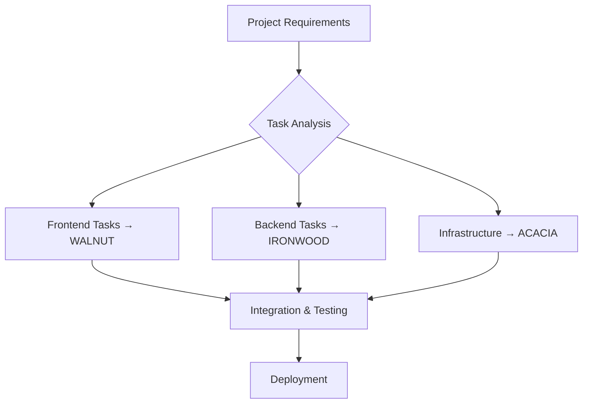

# Development Workflow Guide

## Overview

This guide outlines the recommended development workflow when using the Distributed AI Development System for any software project. The system is designed to coordinate multiple AI agents across your infrastructure to handle different aspects of development work.

## Core Workflow Principles

### 1. Task Decomposition
Break down complex development tasks into smaller, agent-specific components:
- **Frontend Development** → WALNUT Agent (React, TypeScript, UI/UX)
- **Backend Development** → IRONWOOD Agent (APIs, databases, server logic)
- **Infrastructure & DevOps** → ACACIA Agent (Docker, deployment, monitoring)
- **Testing & QA** → Any agent with testing capabilities
- **Documentation** → Agents with documentation writing capabilities

### 2. Agent Specialization
Each agent in your network has specific strengths:

#### WALNUT Agent - Senior Full-Stack Developer
- **Best for**: Complete application development, complex frontend components
- **Models**: starcoder2:15b, qwen3, devstral
- **Strengths**: React/Next.js, TypeScript, full-stack architecture

#### IRONWOOD Agent - Backend Specialist  
- **Best for**: API development, database design, server-side logic
- **Models**: deepseek-coder-v2, devstral, phi4
- **Strengths**: Node.js, Express, database optimization, testing

#### ACACIA Agent - Infrastructure Specialist
- **Best for**: DevOps, system architecture, deployment strategies
- **Models**: deepseek-r1:7b, codellama, qwen2.5
- **Strengths**: Docker, Kubernetes, security, system design

## Development Workflows by Project Type

### Web Application Development



**Typical Task Distribution:**
1. **WALNUT**: React components, TypeScript interfaces, state management
2. **IRONWOOD**: REST APIs, database schemas, authentication logic
3. **ACACIA**: Docker configuration, deployment scripts, monitoring setup

### API Service Development

**Primary Agent**: IRONWOOD (Backend specialist)
**Supporting Agents**: ACACIA (infrastructure), WALNUT (documentation/frontend clients)

**Workflow:**
1. API design and OpenAPI specification
2. Database schema design
3. Endpoint implementation and testing
4. Infrastructure setup and deployment
5. Client SDK generation (if needed)

### Mobile Application Development

**Primary Agent**: WALNUT (Full-stack development)
**Supporting Agents**: IRONWOOD (backend APIs), ACACIA (deployment)

**Workflow:**
1. React Native/Flutter app structure
2. Component development and navigation
3. Backend API integration
4. Testing and debugging
5. Build and deployment configuration

## Task Coordination Strategies

### Sequential Development
Tasks completed in order, with each agent building on previous work:
```
Database Design → API Development → Frontend Implementation → Testing → Deployment
```

### Parallel Development  
Independent tasks executed simultaneously:
```
Frontend Development (WALNUT) || Backend Development (IRONWOOD) || Infrastructure (ACACIA)
```

### Iterative Development
Cycles of development with continuous integration:
```
Sprint 1: Core Features → Sprint 2: Advanced Features → Sprint 3: Polish & Optimization
```

## Quality Control Process

### Multi-Agent Code Review
1. **Primary Agent** develops the initial implementation
2. **Secondary Agent** reviews code for quality and improvements
3. **Claude** coordinates final integration and approval

### Testing Strategy
- **Unit Tests**: Agent that wrote the code creates basic tests
- **Integration Tests**: IRONWOOD agent (backend specialist) handles complex testing
- **End-to-End Tests**: WALNUT agent (full-stack) creates user workflow tests

### Documentation Requirements
- **Code Documentation**: Inline comments by the developing agent
- **API Documentation**: IRONWOOD agent for backend APIs
- **User Documentation**: Dedicated documentation agent or WALNUT for user-facing docs

## Monitoring and Performance

### Real-Time Agent Monitoring
```bash
# Monitor all agents during development
python3 src/agents/simple_monitor.py

# Advanced monitoring with resource usage
python3 src/agents/advanced_monitor.py
```

### Performance Optimization
- **Task Load Balancing**: Distribute work based on agent capabilities and current load
- **Model Selection**: Choose appropriate models based on task complexity
- **Resource Management**: Monitor GPU/CPU usage across the network

## Integration with External Tools

### Version Control (Git)
- Each agent can work on separate branches
- Claude coordinates merge conflicts and integration
- Automated testing before merging

### CI/CD Pipelines
- ACACIA agent sets up GitHub Actions/GitLab CI
- Automated deployment to staging/production
- Integration with monitoring and alerting

### Project Management
- Tasks tracked in GitHub Issues or Jira
- Agents can create and update issue status
- Progress reporting and time estimation

## Best Practices

### Task Assignment
1. **Match complexity to capability**: Assign complex architectural decisions to senior agents
2. **Consider context**: Some agents have better domain knowledge for specific tasks
3. **Load balance**: Distribute work to prevent bottlenecks

### Communication Patterns
1. **Clear specifications**: Provide detailed requirements for each task
2. **Context sharing**: Ensure agents have access to relevant project information
3. **Regular check-ins**: Monitor progress and adjust assignments as needed

### Error Handling
1. **Graceful degradation**: If one agent is unavailable, redistribute tasks
2. **Quality gates**: Don't proceed if critical components fail validation
3. **Rollback procedures**: Maintain ability to revert problematic changes

## Example Project Workflows

### E-commerce Web Application

**Phase 1: Foundation (Week 1)**
- ACACIA: Docker environment, PostgreSQL setup
- IRONWOOD: Database schema, user authentication API
- WALNUT: Basic React app structure, routing

**Phase 2: Core Features (Weeks 2-3)**
- IRONWOOD: Product catalog API, shopping cart logic
- WALNUT: Product listing, cart components, checkout flow
- ACACIA: Payment integration infrastructure

**Phase 3: Advanced Features (Week 4)**
- WALNUT: User dashboard, order history
- IRONWOOD: Order management API, inventory tracking
- ACACIA: Monitoring, logging, performance optimization

### API-First Microservice

**Phase 1: Design (Days 1-2)**
- IRONWOOD: OpenAPI specification, database design
- ACACIA: Service architecture, deployment strategy

**Phase 2: Implementation (Days 3-7)**
- IRONWOOD: Core API endpoints, business logic
- ACACIA: Docker configuration, CI/CD pipeline

**Phase 3: Testing & Documentation (Days 8-10)**
- IRONWOOD: Comprehensive test suite
- WALNUT: API documentation, client SDKs
- ACACIA: Load testing, performance monitoring

## Troubleshooting Common Issues

### Agent Overload
**Symptoms**: Slow response times, high resource usage
**Solutions**: 
- Redistribute tasks to other agents
- Break down complex tasks into smaller components
- Scale up agent resources if needed

### Context Loss
**Symptoms**: Agents producing inconsistent or incorrect results
**Solutions**:
- Provide more detailed task specifications
- Share relevant project context and documentation
- Use Claude to maintain overall project coherence

### Integration Conflicts
**Symptoms**: Code from different agents doesn't work together
**Solutions**:
- Establish clear interfaces and contracts upfront
- Regular integration testing throughout development
- Use Claude to resolve conflicts and ensure consistency

## Measuring Success

### Velocity Metrics
- **Tasks completed per sprint**
- **Time from task assignment to completion**
- **Code quality scores** (automated analysis)

### Quality Metrics
- **Bug density** in agent-generated code
- **Test coverage** percentage
- **Performance benchmarks** for critical operations

### Efficiency Metrics
- **Agent utilization** rates
- **Resource consumption** per task
- **Cost savings** compared to traditional development

This workflow guide provides a framework for leveraging your distributed AI development network effectively across any type of software project. Adapt these patterns based on your specific requirements and agent capabilities.